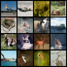
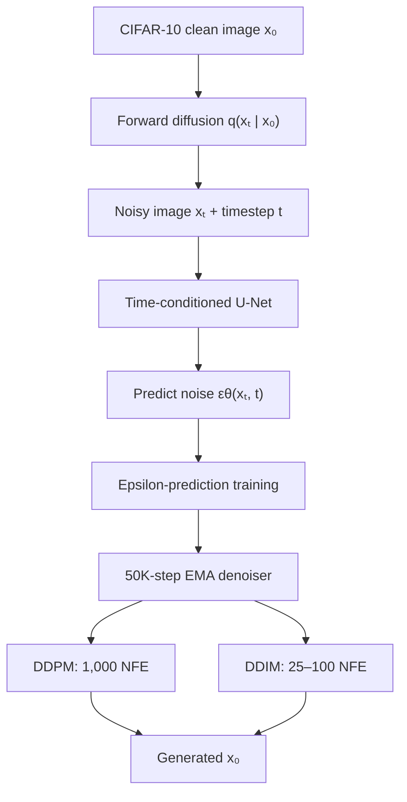

# Diffusion Models from First Principles

A from-scratch PyTorch implementation of DDPM and DDIM on CIFAR-10, covering
forward diffusion, a custom time-conditioned U-Net, epsilon-prediction
training, EMA and exact checkpoint resume, ancestral generation, and
accelerated deterministic sampling.

## Generated Samples After 50K Training Steps

The 12.85M-parameter model was trained for 50,000 steps on the full CIFAR-10
training split. This fixed-seed grid uses the final EMA checkpoint and the
validated 1,000-step ancestral DDPM sampler.



## Training Progression

Using the same fixed initial-noise seeds at each checkpoint, the samples
progress from coarse texture at 10K steps to color-separated silhouettes at
25K and recognizable CIFAR-like structure at 50K. The final training loss was
`0.033687`, and the last-1,000/first-1,000 mean-loss ratio was `0.465576`.


## Accelerating Sampling with DDIM

The same 50K-step EMA denoiser was evaluated with ancestral DDPM and
deterministic DDIM (`eta=0`). Every condition started from the same materialized
batch of 16 initial Gaussian tensors; the four columns below are aligned by
initial-noise seed.


| Sampler | NFE | Median H100 runtime | Speedup |
|---|---:|---:|---:|
| DDPM | 1000 | `4.611 s` | `1.00×` |
| DDIM | 100 | `0.450 s` | **`10.24×`** |
| DDIM | 50 | `0.225 s` | **`20.52×`** |
| DDIM | 25 | `0.112 s` | **`41.03×`** |

Deterministic DDIM reused the same 50K-step EMA denoiser and reduced sampling
to 25–100 network evaluations, yielding measured 10.2×–41.0× H100 speedups
while retaining recognizable CIFAR-like structure in the fixed 16-seed
qualitative comparison.

This visual comparison is not FID/KID or distribution-level image-quality
evidence. The timing result is specific to this checkpoint, implementation,
batch, hardware, and synchronized three-repeat protocol. DDPM is intrinsically
stochastic but repeated bitwise under a frozen reverse RNG seed; eta-zero DDIM
requires no reverse-step random draws and is deterministic conditional on the
initial `x_T`.

## How the System Fits Together



## What I Built

- A linear DDPM noise schedule and closed-form forward sampler
  `q(x_t | x_0)`.
- A custom time-conditioned U-Net with residual blocks, skip connections, and
  attention at 16x16 resolution.
- Epsilon-prediction training on CIFAR-10 with AdamW and exponential moving
  average weights.
- Versioned checkpoints that preserve the model, EMA, optimizer, global step,
  configuration, and Python/PyTorch random state for exact resume.
- A 1,000-step ancestral DDPM sampler and an eta-zero DDIM sampler that reuses
  the same trained denoiser without retraining.
- Reproducible experiment configurations, fixed-seed visual comparisons,
  artifact hashes, and CPU-only continuous integration.

## Core Mathematics

With `alpha_t = 1 - beta_t` and
`bar_alpha_t = product_{s=1}^t alpha_s`, the forward process can sample any
timestep directly:

```text
x_t = sqrt(bar_alpha_t) x_0 + sqrt(1 - bar_alpha_t) epsilon,
epsilon ~ N(0, I).
```

The U-Net receives both `x_t` and `t` and learns to recover the sampled noise:

```text
L_simple = E[ || epsilon - epsilon_theta(x_t, t) ||^2 ].
```

DDPM uses the predicted noise to parameterize a stochastic ancestral reverse
transition. DDIM uses the same prediction function on a shorter trajectory;
with `eta=0`, its reverse update is deterministic conditional on `x_T`. Full
derivations are in:

- [DDPM forward process](docs/ddpm_forward_process.md)
- [DDPM reverse process](docs/ddpm_reverse_process.md)
- [DDIM sampling](docs/ddim_sampling.md)

## Reproduce and Validate

Create a local environment and run the inexpensive CPU checks:

```bash
python3 -m venv .venv
.venv/bin/pip install -e '.[dev]'
.venv/bin/python -m pytest -q
.venv/bin/ruff check .
.venv/bin/ruff format --check .
```

The current suite contains 72 tests covering data transforms, diffusion
equations, the U-Net, training, EMA/checkpoint behavior, DDPM/DDIM sampling,
and experiment-figure regression. CI does not download CIFAR-10, train a model,
or require a GPU.

Small local demonstrations:

```bash
.venv/bin/python scripts/generate_cifar10_grid.py
.venv/bin/python scripts/generate_forward_process_grid.py
.venv/bin/python scripts/run_synthetic_optimization.py \
  --config configs/synthetic_optimization.json
```

Completed experiment outputs are immutable. Reproducing a scientific run must
use a new numbered try and new output paths. Full CIFAR-10 training and the H100
runtime comparison are guarded Slurm workflows; see
[cluster/README.md](cluster/README.md).

## Evidence and Reproducibility

- [Full CIFAR-10 training report](Reports/milestone_06.md): exact checkpoint,
  configuration, loss gates, runtime, failures, and qualitative assessment.
- [DDPM/DDIM comparison report](Reports/milestone_07.md): frozen protocol,
  exact timings, hashes, visual inspection, provenance, and limitations.
- [Machine-readable DDIM comparison](Experiments/exp005-ddim-sampling-speed-quality-comparison/try01/results/comparison.json)
- [DDIM comparison manifest](Experiments/exp005-ddim-sampling-speed-quality-comparison/try01/results/manifest.json)
- [Project specification](PROJECT_SPEC.md)

The run persisted the fixed initial-noise seeds but not an explicit hash of the
materialized `x_T` batch. The exact implementation passed one in-memory batch
to every sampler condition; a batch hash was reconstructed locally from the
frozen generation function and seeds and is documented as derived—not
run-recorded—evidence.

## Repository Layout

```text
src/diffusion_models/   reusable DDPM, DDIM, U-Net, training, and checkpoint code
scripts/                reproducible local and experiment entry points
configs/                frozen architecture and run configurations
tests/                  CPU correctness and regression tests
docs/                   mathematical derivations and implementation notes
Experiments/            immutable experiment plans, tries, results, and reports
Reports/                milestone-level evidence summaries
cluster/                guarded Hellbender/Slurm execution workflows
```

## Scope

This project demonstrates a complete, tested DDPM/DDIM learning pipeline on
CIFAR-10 and a controlled checkpoint-specific sampling-speed comparison. It
does not establish FID/KID parity, likelihood, held-out generalization,
cross-hardware performance, or universal DDIM quality at low step counts.
