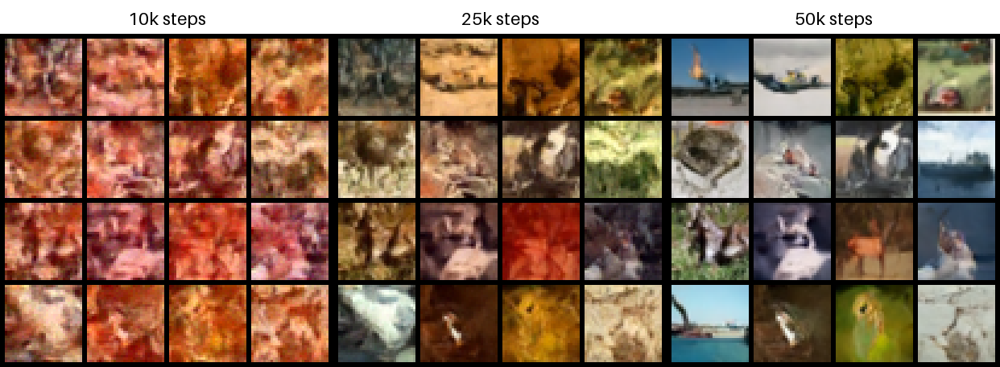
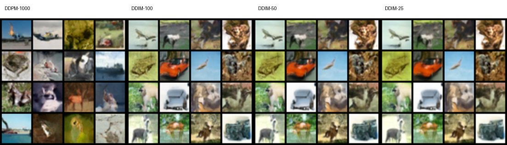

# Diffusion Models from Scratch

A compact PyTorch project for learning diffusion models by deriving and
implementing a DDPM one component at a time. The initial target is CIFAR-10.

The governing design and acceptance criteria are in [PROJECT_SPEC.md](PROJECT_SPEC.md).

## Setup

```bash
python3 -m venv .venv
.venv/bin/pip install -e '.[dev]'
```

## Generate the CIFAR-10 grid

```bash
.venv/bin/python scripts/generate_cifar10_grid.py
```

This downloads CIFAR-10 into `data/` when needed and writes
`figures/cifar10_train_grid_seed0.png`.

## Generate the forward-process grid

```bash
.venv/bin/python scripts/generate_forward_process_grid.py
```

This applies one fixed noise tensor to one normalized CIFAR-10 image at code
timesteps `0, 100, 250, 500, 750, 999` and writes
`figures/cifar10_forward_process_seed0.png`.

The schedule and forward-process API live under
`diffusion_models.diffusion`. Mathematical details and the code-index mapping
are in [docs/ddpm_forward_process.md](docs/ddpm_forward_process.md).

## Reproduce the learnability gates

```bash
.venv/bin/python scripts/run_synthetic_optimization.py \
  --config configs/synthetic_optimization.json

.venv/bin/python scripts/run_overfit_16.py \
  --config configs/overfit_16.json \
  --download
```

These immutable experiment outputs already exist in `EXP001/try01`, so reruns
must use a new numbered try and updated output paths. The completed result and
its limited scientific interpretation are documented in
[Reports/milestone_03.md](Reports/milestone_03.md).

## Layout

- `src/diffusion_models/`: reusable implementation
- `scripts/`: reproducible entry points
- `tests/`: inexpensive correctness tests
- `docs/`: mathematical derivations
- `configs/`: frozen architecture and run configurations
- `figures/`: generated visual checks

Milestone 3 verifies that the epsilon-prediction pipeline can learn a fixed
16-image dataset. Milestone 5 validates reverse sampling, and Milestone 6 now
adds the first complete full-CIFAR-10 training result.

## Validate exact checkpoint resume

Milestone 4's corrected immutable result was produced with:

```bash
.venv/bin/python scripts/run_resume_validation.py \
  --config configs/resume_validation_try02.json
```

The existing `try01` and `try02` outputs must not be overwritten; a reproduction
must copy the frozen settings into a new numbered try with new output paths.
EMA, checkpoint schema, the preserved comparator failure, exact corrected
result, and limitations are documented in
[Reports/milestone_04.md](Reports/milestone_04.md).

## Reproduce the DDPM sampling smoke test

```bash
.venv/bin/python scripts/run_sampling_smoke.py \
  --config configs/sampling_smoke.json
```

The existing `EXP003/try01` outputs are immutable, so reproduction requires a
new numbered try and output paths. The command performs 1,000 CPU inference
steps through a randomly initialized EMA smoke U-Net and creates a six-state
debug trajectory. It does not train, download data, or measure image quality.
The derivation is in [docs/ddpm_reverse_process.md](docs/ddpm_reverse_process.md)
and the validated result is in
[Reports/milestone_05.md](Reports/milestone_05.md).

## Full CIFAR-10 training

Milestone 6 uses the existing primary U-Net and validated DDPM components. Its
frozen configuration and gates are in
[docs/plans/full_cifar10_training.md](docs/plans/full_cifar10_training.md).
The 50,000-step H100 run completed with 50,000 finite contiguous records; the
last-1,000/first-1,000 mean-loss ratio was `0.465576`, and the fixed-seed EMA
progression reached recognizable CIFAR-like samples. See
[Reports/milestone_06.md](Reports/milestone_06.md) for exact provenance,
failures, artifacts, and limitations. Heavy reproduction remains Slurm-only
through the guarded commands in [cluster/README.md](cluster/README.md).



## Deterministic DDIM acceleration

Milestone 7 reuses the exact 50k EMA checkpoint and the same 16 initial tensors
to compare DDPM-1000 with deterministic DDIM-100/50/25 on one H100 NVL. The
observed synchronized median runtimes were `4.611370`, `0.450342`, `0.224743`,
and `0.112395` seconds, giving measured DDIM speedups of `10.2397x`,
`20.5184x`, and `41.0284x`. Every condition used its exact frozen NFE, produced
a finite `[16,3,32,32]` tensor, and repeated bitwise.

DDPM is intrinsically stochastic, but repeated runs were bitwise reproducible
under the frozen reverse RNG seed. DDIM with `eta=0` requires no reverse-step
random draws and is deterministic conditional on the initial `x_T`.

The fixed grids remain recognizably CIFAR-like at all three DDIM step counts;
no clear monotonic 100-to-25 visual degradation is evident in this 16-seed
set. This is not FID/KID or a distribution-level quality claim. See
[Reports/milestone_07.md](Reports/milestone_07.md) for exact timings, hashes,
visual assessment, provenance, and limitations.


