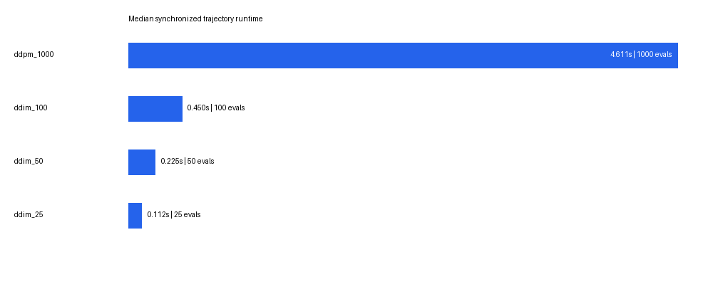

# Milestone 7: Deterministic DDIM And Runtime Comparison

## Status

`COMPLETED` — `EXP005/try01` passed the frozen structural, provenance,
determinism, timing, and visual-inspection gates. No training, checkpoint
extension, FID/KID evaluation, or additional sampler was run.

## Exact run identity

- Slurm job: `16409278` (`COMPLETED`, exit `0:0`)
- Started: `2026-08-12T11:43:08`
- Finished: `2026-08-12T11:43:33`
- Scheduler elapsed time: `00:00:25`
- Node/GPU: `g033`, `NVIDIA H100 NVL`
- Run commit: `20c6ea9fd8b558016a1e995abb7db0ea723962fc`
- GitHub Actions: `31545879080` passed
- Cluster preflight: job `16409245` passed
- Comparison config SHA-256:
  `80c6e27776ff6aa839145fa09cae006a17dbbc1a3ae3d138bf6379fe387a1108`
- Training config SHA-256:
  `8d4480ef52c2d299320cc374ae893b07a16690e091c88f303d1b9c8bf0140487`
- Checkpoint: `EXP004/try01` step-50,000 EMA
- Checkpoint SHA-256:
  `f6b64f7028432ac1690029564610918e68e0c45b5188a97961863eadd79b17b9`
- Raw comparison SHA-256:
  `97aaec5bdb831d11b92ab1621aacdd9ee147b8da68aeb8fb6320cd1c057c4a62`
- Raw manifest SHA-256:
  `7a097062b1f3d35062857cc1022200505fa9debb60f0fe9d5e9172e737d3cd65`

The remote checkpoint and both repository configurations were independently
hashed after completion and match the frozen identities. The staged log,
Slurm stdout, and `comparison.json` are byte-identical.

## Frozen comparison

All settings used the same EMA denoiser, one float32 batch of 16 initial
Gaussian tensors from seeds `1000..1015`, one H100, one untimed warm-up, and
three complete synchronized timing repeats. DDPM recreated reverse generator
seed `109` for every repeat. DDIM used `eta=0` and consumed no reverse-step
noise.

DDPM is intrinsically stochastic, but repeated runs were bitwise reproducible
under the frozen reverse RNG seed. DDIM with `eta=0` requires no reverse-step
random draws and is deterministic conditional on the initial `x_T`.

| Sampler | NFE | Repeat runtimes (s) | Mean (s) | Median (s) | Population SD (s) | Median throughput (images/s) | Median speedup |
|---|---:|---|---:|---:|---:|---:|---:|
| DDPM-1000 | 1000 | `4.623993`, `4.611370`, `4.599018` | `4.611460` | `4.611370` | `0.010196` | `3.4697` | `1.0000x` |
| DDIM-100 | 100 | `0.451788`, `0.450159`, `0.450342` | `0.450763` | `0.450342` | `0.000729` | `35.5286` | `10.2397x` |
| DDIM-50 | 50 | `0.224851`, `0.224743`, `0.224268` | `0.224621` | `0.224743` | `0.000253` | `71.1923` | `20.5184x` |
| DDIM-25 | 25 | `0.112395`, `0.112336`, `0.112584` | `0.112438` | `0.112395` | `0.000106` | `142.3556` | `41.0284x` |

Speedups and throughput use the preregistered synchronized median runtimes,
not NFE ratios. Every setting produced a finite `[16,3,32,32]` tensor and the
exact expected call count in every repeat.

## Determinism and output identities

| Sampler | Calls per repeat | Repeated output hash | Bitwise equal across repeats |
|---|---|---|---|
| DDPM-1000 | `1000,1000,1000` | `c28a6c5b6eb234bd44ee6a3daaa7d50b414d401195f1f65faa82064a926148ca` | yes |
| DDIM-100 | `100,100,100` | `e5464b647ce941039442d4c89a90c1f5220a3c347bece29fc61393c8afdfbef7` | yes |
| DDIM-50 | `50,50,50` | `a5c38c7b2abdfabaaab891b0dfde27b1da34d5d68dfe31974a042128e0a45255` | yes |
| DDIM-25 | `25,25,25` | `649b4d4ba799dfbd43e07efa26e56bd1b41791636cf524d61628d83b92ef0fff` | yes |

The stored schedule lists are strictly descending, unique, preserve endpoints
`999` and `0`, and have exact lengths `1000`, `100`, `50`, and `25`. Their
canonical compact-JSON SHA-256 values are:

- DDPM-1000: `0228ee509f78bd7c540728914b9c7f0a7a490bb9827aa262a63426f8e04f2850`
- DDIM-100: `40a4e8e530762f3d615233f3840c645aa9fd0ea4578d2b708f9f6c31291e488d`
- DDIM-50: `3d0d2a9601610db3b469622622b6eceee8ec7514ee06e5784c4390e47a95abb3`
- DDIM-25: `7243e68086d5ad5b97fbcd4d41dd11939a3f0ed8fff18659550bf648bb110e85`

The experiment shared one materialized initial-noise batch across all sampler
conditions. The run persisted seed provenance but did not persist an explicit
hash of that batch; a hash was reconstructed locally from the frozen generation
function and seeds. The reconstructed batch SHA-256 is
`ea6c2359cdb092aa49c1429d74b185ca2a8168e016fce47cfd16ae30bd30768a`;
this is derived audit evidence, not a run-recorded hash.

## Visual inspection

All four grids contain recognizable CIFAR-like animals, vehicles, and coarse
scenes. DDIM-100, DDIM-50, and DDIM-25 preserve the same cellwise subjects and
are visually very similar; their tensor hashes prove that they are not exact
duplicates. No clear monotonic degradation from 100 to 25 DDIM steps is
visible in this 16-seed set. DDPM differs more strongly because its frozen
reverse process is stochastic even with the same initial `x_T`. No catastrophic
failure, column mispairing, or clipping error is visible in the sample grids.

The raw job runtime figure clipped the DDPM annotation at the right edge. The
raw figure is preserved as
`runtime_comparison_raw_job16409278.png`; a plotting-only repair was tested and
regenerated the presentation figure from the immutable `comparison.json`:

## Valid conclusion

For the frozen 50k EMA checkpoint, 16 initial tensors, and one H100 NVL,
deterministic DDIM achieved exact 100/50/25-call trajectories and measured
median speedups of `10.2397x`, `20.5184x`, and `41.0284x` relative to the
1,000-call DDPM baseline. The fixed grids remained recognizably CIFAR-like.

This is a checkpoint-, seed-, batch-, implementation-, and hardware-specific
quality-compute observation. It is not distribution-level image-quality
evidence and does not support FID/KID, generalization, likelihood, or universal
runtime claims.

## Evidence

- [Frozen plan](../Experiments/exp005-ddim-sampling-speed-quality-comparison/plan.md)
- [Try report](../Experiments/exp005-ddim-sampling-speed-quality-comparison/try01/report.md)
- [Machine-readable comparison](../Experiments/exp005-ddim-sampling-speed-quality-comparison/try01/results/comparison.json)
- [Run manifest](../Experiments/exp005-ddim-sampling-speed-quality-comparison/try01/results/manifest.json)
- Remote immutable try:
  `/home/xggh8/data/diffusion-models-from-scratch/exp005-ddim-comparison/try01`

## Validation

- `.venv/bin/python -m pytest -q`: `72 passed`
- `.venv/bin/ruff check .`: passed
- `.venv/bin/ruff format --check .`: passed
- `git diff --check`: passed
- Repository Markdown/local-link validation: passed
- Corrected runtime-figure regression test: passed
